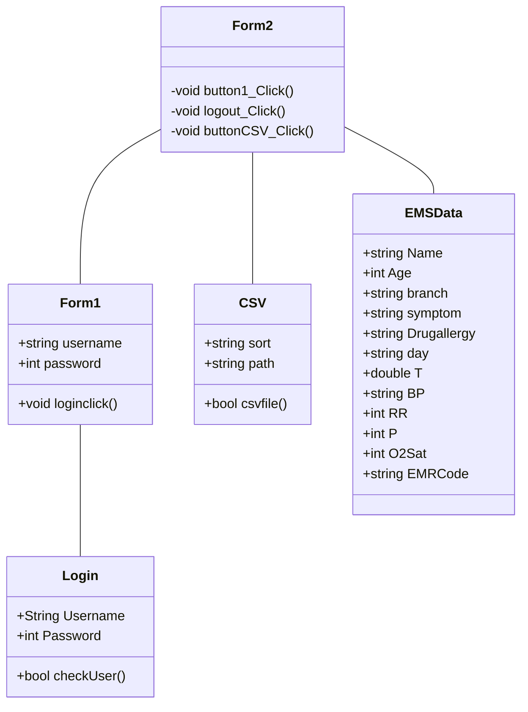

# ความเป็นมาของโปรแกรม
#### โปรแกรมสร้างขึ้นเพื่อเก็บข้อมูลการเจ็บป่วยภายในมหาลัยขอนแก่น วิทยาเขตหนองคาย

# วัตถุประสงค์ของโปรแกรม
#### จัดทำขึ้นเพื่อให้ EMR ในชุมนุมกู้ชีพบันทึกข้อมูลการเจ็บป่วยในมหาลัยขอนแก่น วิทยาเขตหนองคาย เพื่อทำสรุปจำนวนการปฏิบัติหน้าที่ของ EMR แต่ละคนและบันทึกยอดการเจ็บป่วยของนักศึกษาในแต่ละเดือน

# ชื่อของผู้พัฒนาโปรแกรม
### นางสาวอรยมล  ประชานันท์  663450352-3

